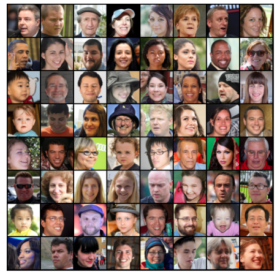
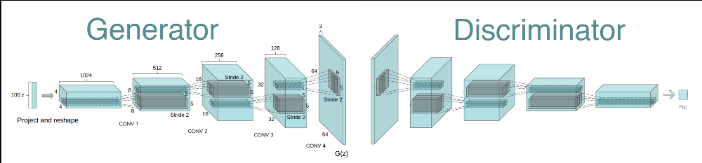
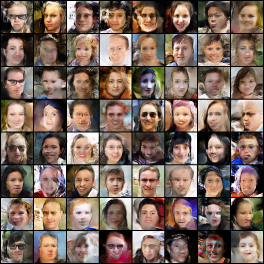
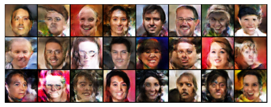

# DCGAN Face Generator

В данном ноутбуке содержится имплементация Generative adversarial network (GAN) с использованием Pytroch. Данный GAN был обучен на датасете лиц людей [Flickr Faces](https://github.com/NVlabs/ffhq-dataset), который содержит изображения лиц людей в высоком разрешении (1024х1024). В нашем датасете 3143 изображения.

## DCGAN

DCGAN состоит из генератора и дискриминатора.
Архитектура дискриминатора:
 
**Conv2d > BatchNorm2d > LeakyReLU**
 

Архитектура генератора:
 
**TransposeConv2d > BatchNorm2d > LeakyReLU** и **nn.Tanh** на выходном слое.
 

## Обучение
Визуализация процесса обучения модели на датасете из 3143 картинок:

Гиперпараметры использованные в обучении:
	
	image_size = 64
	batch_size = 64
	lr_d = 0.0002 # discriminator learning rate
	lr_g = 0.0002 # generator learning rate
	epochs = 150 # number of epochs
	latent_size = 128 # size of the latent space
	latent_shape = 1 # latent shape

## Результаты

Cгенерированные изображения после 150 эпох:

Сэмплирование генератора. На вход подаются векторы из нормального распределения:

